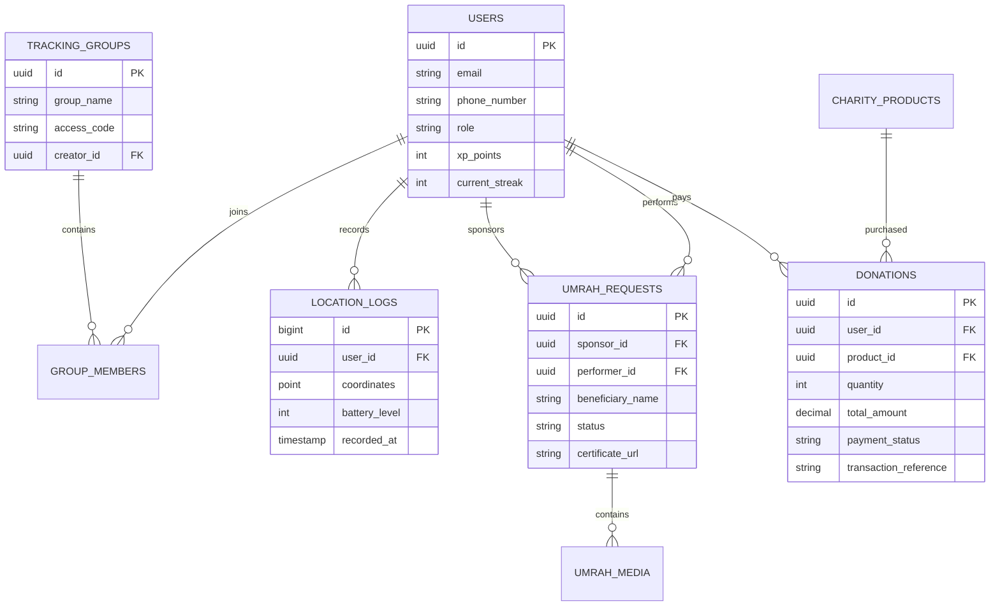

# Niya | نية — Complete Product Specification
### The Premium All-in-One Islamic Platform for Worship, Charity, Umrah & Family Safety

---

## 1. Product Vision
**Niya (نية)** is the world's first luxury-tier, enterprise-grade Islamic lifestyle and safety application. Designed to be a daily spiritual companion, Niya merges high-fidelity design aesthetics with deep technological capabilities. The platform bridges the gap between digital spirituality and real-world sacred services, enabling users to manage their daily worship (Quran, Tasbeeh, Prayer Times, streaking/gamification), perform charity inside Makkah and Madinah, coordinate private and trust-based Umrah services on behalf of loved ones with real-time GPS verification, and protect their families inside dense crowds at the Holy Mosques via advanced WebSocket-driven location-sharing and geofencing tools.

---

## 2. Business Model & Monetization Strategy
Niya operates on a sustainable, ethical, and highly profitable hybrid fintech-marketplace model:
1. **Umrah on Behalf Commission (Service Fee)**: A flat 10-15% processing fee on "Umrah on Behalf" transactions (matching vetted students/scholars in Saudi Arabia with global sponsors).
2. **Charity Marketplace Administrative Cover**: A 2.5% payment gateway and infrastructure overhead fee on donations (transparently disclosed to support operational stability; 0% commission on the principal charity).
3. **Premium Spiritual Membership (SaaS)**: A subscription tier ("Niya Gold") offering custom premium Arabic calligraphic themes, luxury 3D tasbeeh skins, high-fidelity adhan vocals, and family GPS location recording logs exceeding 48 hours.
4. **Corporate Corporate Sadaqah Partnerships**: B2B integrations allowing Islamic banks and global brands to sponsor charity packages directly in Haram, with corporate dashboard reporting.

---

## 3. User Personas

### Persona A: Tariq Al-Mansoor (The Connected Sponsor)
* **Age**: 42 | **Occupation**: Tech Executive | **Location**: London, UK
* **Motivation**: Tariq wants to perform daily Sadaqah and sponsor continuous charity (Sadaqah Jariyah) in Makkah on behalf of his deceased father, but lacks a transparent, verifiable channel to do so.
* **Pain Point**: Skeptical of standard charity channels; wants to see physical proof (photos/videos) that his water distribution or Umrah-on-behalf is fully executed.

### Persona B: Layla Benguerir (The Family Protector)
* **Age**: 34 | **Occupation**: Pediatric Nurse | **Location**: Marseille, France
* **Motivation**: Layla is performing Umrah with her elderly mother and two young children. She is highly anxious about losing them in the massive crowds surrounding the Kaaba and Safa/Marwa.
* **Pain Point**: Spotty internet, laggy tracking apps, and high anxiety of getting separated with no clear navigation back to each other.

---

## 4. User Journeys

### Journey 1: Sponsoring an "Umrah on Behalf"
```
[Select Umrah Feature] ➔ [Input Beneficiary Info] ➔ [Select Custom Dua & Accents] ➔ 
[Checkout via Apple Pay] ➔ [Assigned to Saudi Performer] ➔ [Performer Begins Journey] ➔ 
[Live Tracker with Map & Video updates] ➔ [Completion Certificate & High-Res Dua Video Download]
```

### Journey 2: Family Lost Mode Emergency Sequence
```
[User gets separated in crowd] ➔ [Presses "I'm Lost" button] ➔ [High-priority push alert sent to all Group Members] ➔ 
[Members' apps display private directional arrows & distance metrics] ➔ [Real-time geofenced routing generated] ➔
[Reunion achieved] ➔ [Lost Mode disabled]
```

---

## 5. App Sitemap

```
Home Dashboard
├── Auth & Profile Settings
│   ├── Login/Register (OAuth, JWT, OTP)
│   ├── Profile Settings & badging
│   └── Donation & Order Ledger
├── Digital Quran Hub
│   ├── Surah/Juz Navigation
│   ├── Custom Typographic Reader
│   ├── Audio Reciter Player (Offline Sync)
│   └── Daily Goal Tracker
├── Worship & Tasbeeh
│   ├── 3D Interactive Tasbeeh Ring
│   ├── Dhikr Custom List Manager
│   └── Streak & XP Leaderboard
├── Prayer & Islamic Tools
│   ├── GPS Prayer Times Engine
│   ├── 3D Qibla Compass (Gyro-assisted)
│   └── Hijri Calendar & Fasting Reminders
├── Charity Marketplace
│   ├── Haram Water/Date Distribution
│   ├── Mosque Maintenance & Quran Endowments
│   └── Double-entry Checkout & Cart
├── Umrah Hub
│   ├── Apply for Personal Umrah (Visas, Docs)
│   ├── Umrah on Behalf Application Form
│   └── Performer Real-time Status Tracker (WebSocket Timeline)
└── Family Safety Map
    ├── Group Creation & Access Code sharing
    ├── Dynamic WebSocket Live Location Map
    └── Lost Mode Dashboard & Geofenced Alerts
```

---

## 6. Information Architecture
The platform utilizes an architecture optimized for performance and offline reliability:
* **Local First Strategy**: SQLite (via Flutter Drift) and SharedPreferences store core user states (Quran progress, offline audio files, offline prayer times databases, and cached streaks).
* **Distributed Real-time Sync**: Critical tracking coordinate streams run directly over WebSockets backed by Redis on the Django server, bypass standard HTTP pipelines to ensure <100ms latency.
* **Double-Entry Ledger Architecture**: Financial interactions and charity updates are strictly tied to transaction IDs with persistent cryptographic signing keys.

---

## 7. UI/UX Design System

### Visual Direction: Premium Islamic Luxury
* **Primary Deep Gold**: `#C5A880` to `#8E6D3E` (Linear metallic gradient representing divine radiance and premium feel)
* **Secondary Gold-Accent**: `#EAD2AC`
* **Obsidian Base (Dark Mode)**: `#0E1113` to `#16191C` (Deep basalt/obsidian stone inspiration, reminiscent of the Kaaba’s marble structure)
* **Alabaster Base (Light Mode)**: `#F7F9FA` to `#FFFFFF` (Pure white Thobe/Ihram linen textures)
* **Typography**:
  - Arabic: **Amiri** / **Cairo** (Geometric luxury sans-serif and calligraphic serif)
  - English: **Cinzel** (For luxury headers) / **Outfit** (For crisp modern UI numbers and text)
* **Motion & Physics**: Fluid spring curves (damping ratio `0.85`, response `0.3`) for 3D interactions, simulating a high-end physical bead feel.

---

## 8. Complete Feature Breakdown (15 Features)
1. **Authentication & Identity**: JWT access and refresh token authentication with Google/Apple OAuth and OTP-based mobile registration.
2. **Digital Quran Engine**: Dynamic layout engine rendering high-definition Arabic calligraphic fonts, complete with recitation player and bookmark caching.
3. **Interactive 3D Tasbeeh**: Mathematical 3D rotation bead ring rendered via Vector3 projections, responding directly to physical gyroscope changes and swiping.
4. **Adaptive Prayer Times**: Fully functional offline mathematical calculations (using coordinate databases) with local push notification scheduler.
5. **Charity Marketplace**: Cart system showing dedicated projects, dynamic pricing, dedication messages, and real-time distribution feedback.
6. **Umrah on Behalf Platform**: High-fidelity pipeline connecting global users with vetted students of knowledge in Makkah to perform Umrah.
7. **Personal Umrah Application**: Form engine supporting document upload (OCR and face recognition options) to request Saudi Umrah authorizations.
8. **Real-time Performer Timeline**: Timeline view showing state progression (`Submitted ➔ Accepted ➔ Scheduled ➔ Performing ➔ Completed`) with rich media galleries (photo/video attachments).
9. **Family Tracker Group**: Group coordinates synchronization engine using WebSockets.
10. **Lost Mode HUD**: Directional radar navigation (bearing-to-target calculations) helping users find each other in crowds without complex map rendering.
11. **Gamification Engine**: Worship streaking engine inspired by Duolingo, implementing level-ups, dynamic titles, and global leaderboard ranking lists.
12. **Group Quran Completion (Khatm)**: Collaboration engine allocating Juz segments to different team members, tracking completions, and aggregating rewards.
13. **Community & Programs**: Boards for local Ramadan announcements and charity campaign progress.
14. **Unified Payment Gateway**: Integration of international cards, Apple/Google Pay, and local mada services with automatic checkout splits.
15. **Enterprise Admin Console**: Portal for vetted performers to update statuses, and admins to review donation distributions.

---

## 9. Database Design (PostgreSQL Schema)

```sql
-- Users and Profiles
CREATE TABLE users (
    id UUID PRIMARY KEY DEFAULT gen_random_uuid(),
    email VARCHAR(255) UNIQUE,
    phone_number VARCHAR(50) UNIQUE,
    full_name VARCHAR(255) NOT NULL,
    hashed_password VARCHAR(255),
    role VARCHAR(50) DEFAULT 'user', -- 'user', 'performer', 'admin'
    xp_points INT DEFAULT 0,
    current_streak INT DEFAULT 0,
    longest_streak INT DEFAULT 0,
    created_at TIMESTAMP WITH TIME ZONE DEFAULT CURRENT_TIMESTAMP
);

-- Groups for Family Tracking
CREATE TABLE tracking_groups (
    id UUID PRIMARY KEY DEFAULT gen_random_uuid(),
    group_name VARCHAR(100) NOT NULL,
    access_code VARCHAR(6) UNIQUE NOT NULL,
    creator_id UUID REFERENCES users(id) ON DELETE CASCADE,
    created_at TIMESTAMP WITH TIME ZONE DEFAULT CURRENT_TIMESTAMP
);

-- Group Members
CREATE TABLE group_members (
    group_id UUID REFERENCES tracking_groups(id) ON DELETE CASCADE,
    user_id UUID REFERENCES users(id) ON DELETE CASCADE,
    joined_at TIMESTAMP WITH TIME ZONE DEFAULT CURRENT_TIMESTAMP,
    is_lost BOOLEAN DEFAULT FALSE,
    PRIMARY KEY (group_id, user_id)
);

-- Real-time Geolocation Logs
CREATE TABLE location_logs (
    id BIGSERIAL PRIMARY KEY,
    user_id UUID REFERENCES users(id) ON DELETE CASCADE,
    coordinates GEOMETRY(Point, 4326), -- PostGIS spatial field
    battery_level INT,
    recorded_at TIMESTAMP WITH TIME ZONE DEFAULT CURRENT_TIMESTAMP
);

-- Umrah on Behalf Requests
CREATE TABLE umrah_requests (
    id UUID PRIMARY KEY DEFAULT gen_random_uuid(),
    sponsor_id UUID REFERENCES users(id) ON DELETE RESTRICT,
    performer_id UUID REFERENCES users(id) ON DELETE SET NULL,
    beneficiary_name VARCHAR(255) NOT NULL,
    mother_name VARCHAR(255),
    gender VARCHAR(10) NOT NULL,
    special_dua TEXT,
    status VARCHAR(50) DEFAULT 'Submitted', -- 'Submitted', 'Accepted', 'Traveling', 'Arrived', 'Performing', 'Completed'
    certificate_url VARCHAR(512),
    created_at TIMESTAMP WITH TIME ZONE DEFAULT CURRENT_TIMESTAMP
);

-- Umrah Timeline Progress media
CREATE TABLE umrah_media (
    id UUID PRIMARY KEY DEFAULT gen_random_uuid(),
    request_id UUID REFERENCES umrah_requests(id) ON DELETE CASCADE,
    media_url VARCHAR(512) NOT NULL,
    media_type VARCHAR(10) NOT NULL, -- 'photo', 'video'
    caption VARCHAR(255),
    uploaded_at TIMESTAMP WITH TIME ZONE DEFAULT CURRENT_TIMESTAMP
);

-- Charity Marketplace Items
CREATE TABLE charity_products (
    id UUID PRIMARY KEY DEFAULT gen_random_uuid(),
    title VARCHAR(255) NOT NULL,
    description TEXT,
    unit_price DECIMAL(10, 2) NOT NULL,
    location VARCHAR(100) DEFAULT 'Makkah',
    is_active BOOLEAN DEFAULT TRUE
);

-- Donations Ledger
CREATE TABLE donations (
    id UUID PRIMARY KEY DEFAULT gen_random_uuid(),
    user_id UUID REFERENCES users(id) ON DELETE SET NULL,
    product_id UUID REFERENCES charity_products(id) ON DELETE RESTRICT,
    quantity INT NOT NULL DEFAULT 1,
    total_amount DECIMAL(10,2) NOT NULL,
    dedication_name VARCHAR(255),
    dedication_dua TEXT,
    payment_status VARCHAR(50) DEFAULT 'Pending',
    transaction_reference VARCHAR(255) UNIQUE,
    created_at TIMESTAMP WITH TIME ZONE DEFAULT CURRENT_TIMESTAMP
);
```

---

## 10. ERD Diagram



---

## 11. Django Backend Architecture
Niya uses a Clean DDD-inspired (Domain-Driven Design) Django project layout with asynchronous abilities to power WebSockets:
* **Django Channels**: Used for the Real-time Location Sharing Group Map and Lost Mode updates. Backed by **Redis Channel Layer** for instant pub/sub routing.
* **DRF (Django REST Framework)**: Exposes secure APIs with automated Swagger documentation.
* **Architecture Model**:
  - `controllers/`: Direct HTTP/WebSocket request endpoints routing to services.
  - `services/`: Core Business Logic layer containing clean algorithms (prayer times calculations, points allocator, payment callbacks).
  - `repositories/`: Database interfaces, separating models from logic.
  - `models/`: Clean declarations utilizing standard Django ORM & GeoDjango PostGIS tools.

---

## 12. REST API Design

### Authentication: Register User
* **Endpoint**: `POST /api/v1/auth/register/`
* **Request Payload**:
```json
{
  "email": "tariq@niya.app",
  "phone_number": "+447700900077",
  "full_name": "Tariq Al-Mansoor",
  "password": "SecurePassword123!"
}
```
* **Response (201 Created)**:
```json
{
  "user_id": "c1a9c1de-e9cb-4c54-b52e-9d297ff05bc0",
  "tokens": {
    "access": "eyJhbGciOiJIUzI1NiIsInR5...",
    "refresh": "eyJhbGciOiJIUzI1NiIsInR5..."
  }
}
```

### Charity: Create Donation Booking
* **Endpoint**: `POST /api/v1/donations/create/`
* **Headers**: `Authorization: Bearer <token>`
* **Request Payload**:
```json
{
  "product_id": "b0a56e54-52d3-4613-88fe-7df6415fe88c",
  "quantity": 100,
  "dedication_name": "Father Tariq Al-Mansoor",
  "dedication_dua": "May Allah grant him Jannat-ul-Firdaus"
}
```
* **Response (200 OK)**:
```json
{
  "donation_id": "f8a7e6b5-cd12-4e45-8123-9abcd98765ef",
  "total_amount": 350.00,
  "checkout_url": "https://checkout.niya.app/pay/f8a7e6b5",
  "status": "Pending"
}
```

### Family Safety: Join Location Group
* **Endpoint**: `POST /api/v1/family/groups/join/`
* **Request Payload**:
```json
{
  "access_code": "NYA891"
}
```
* **Response (200 OK)**:
```json
{
  "group_id": "772f913d-5197-4b71-9c8f-e18e38f135b9",
  "group_name": "Al-Mansoor Family Umrah",
  "members": [
    {"user_id": "c1a9c...", "name": "Tariq Al-Mansoor", "is_lost": false},
    {"user_id": "a90b4...", "name": "Layla Benguerir", "is_lost": false}
  ]
}
```

---

## 13. Flutter Architecture (Clean Architecture & OOP)
To maintain structural independence, scalable maintainability, and clean decoupling, the Flutter application implements **Clean Architecture** as visualized:

```
  ┌────────────────────────────────────────────────────────┐
  │                   Presentation Layer                   │
  │  (Widgets, CustomPaint 3D, BLoC/Cubit, Screen Layouts)  │
  └───────────────────────────┬────────────────────────────┘
                              │ Uses Interfaces
                              ▼
  ┌────────────────────────────────────────────────────────┐
  │                      Domain Layer                      │
  │     (Pure Dart: Entities, Use Cases, Repository)       │
  └───────────────────────────▲────────────────────────────┘
                              │ Implements
                              │
  ┌───────────────────────────┴────────────────────────────┐
  │                       Data Layer                       │
  │    (Models, Repository Impl, API/Cache Data Sources)    │
  └────────────────────────────────────────────────────────┘
```

* **Domain Layer (Entities, Use Cases, Repositories)**: Contains pure, zero-dependency Dart business files. Example: `TasbeehEntity`, `PerformIstighfarUseCase`.
* **Data Layer (Models, Data Sources, Repository Implementations)**: Performs parsing, caching, and network exchanges. Example: `UserModel`, `AuthRemoteDataSource`, `UmrahRepositoryImpl`.
* **Presentation Layer (UI, Blocs, Custom 3D Painters)**: Manages rendering and visual states. Example: `ThreeDimensionalTasbeehPainter`, `FamilyCubit`.

---

## 14. Admin Dashboard Specification
An enterprise management dashboard serves admins and authorized performers:
1. **Performer Assignment Engine**: Match incoming Umrah on Behalf requests to verified student performers in Makkah using geoproximity tools.
2. **Real-time Timeline Audit**: Verify photos/videos submitted by performers (using metadata/GPS geo-tag checks) before releasing completion certificates to sponsors.
3. **Charity Inventory Ledger**: Track donations against real-world distributor capacities in Haram (e.g. water tankers distributed).
4. **Interactive Dashboard analytics**: Visualize active location groups, streaks, and global server logs in real time.

---

## 15. Security & Privacy Architecture
1. **End-to-End Coordinate Encryption (E2EE)**: Family locations are encrypted using AES-GCM-256 keys generated locally by group members; coordinate logs on PostgreSQL are fully encrypted, rendering server-side coordinate interception impossible for third parties.
2. **Local Secure Enclave Storage**: Authentication credentials and security keys are persistently saved in the iOS Keychain/Android Keystore via `flutter_secure_storage`.
3. **Strict SSL Pinning**: Preventing man-in-the-middle (MitM) attacks during donation transitions and JWT updates by enforcing SHA-256 certificate thumbprint validations.

---

## 16. Payment Ledger & Reconciliation
To support perfect regulatory auditing and zero-loss financial controls, Niya implements an internal double-entry bookkeeping ledger:

| Transaction ID (UUID) | Source Account | Destination Account | Amount (USD) | Purpose | Ledger Status |
| :--- | :--- | :--- | :--- | :--- | :--- |
| `tx_9012a` | Tariq Al-Mansoor (Client) | Niya Holding (Escrow) | $350.00 | Umrah on Behalf Deposit | Vetted Escrow |
| `tx_9012b` | Niya Holding (Escrow) | Performer Wallet (Escrow) | $300.00 | Assigned Service Fee | Pending Verification |
| `tx_9012c` | Niya Holding (Escrow) | Niya Platform Revenue | $50.00 | Platform Processing Fee | Realized Revenue |
| `tx_9012d` | Performer Wallet (Escrow) | Performer Bank Account | $300.00 | Umrah Completed Release | Cleared |

Reconciliation runs asynchronously via Cron worker scripts every night at 23:59 UTC, verifying matching balances with Stripe and HyperPay processor histories.

---

## 17. Scalability & System Resiliency Strategy
1. **Ramadan & Hajj Peak traffic**: Horizontal scaling of Django web services using Kubernetes auto-scalers based on CPU and socket connection metrics.
2. **Redis-Backed In-Memory DB**: WebSocket coordinate streams read/write to Redis geospatial records (`GEOADD`), flushing updates to PostgreSQL logs asynchronously via Celery batches every 5 minutes to prevent heavy DB locks.
3. **Anycast CDN distribution**: Serving high-definition Quranic recitations, PDFs, and certificates from globally distributed AWS CloudFront CDNs.

---

## 18. MVP Roadmap (Months 1-3)
* **Month 1**: Base Backend & Clean Auth setup. Flutter scaffold UI, theme tokens, and custom mathematical 3D Tasbeeh Engine implementation.
* **Month 2**: Core Islamic utility integration (Prayer times math, Offline Quran player). Payment gateway configurations (Stripe/madas).
* **Month 3**: Umrah on Behalf scheduling mechanism and core WebSocket Family group tracking prototype. Testing and soft launch.

---

## 19. Production Roadmap (Months 4-6)
* **Month 4**: Full implementation of Family Lost Mode directional HUD. Advanced Gamification (streaks, team challenges, Duolingo-style XP engine).
* **Month 5**: Admin validation console, automated PDF certificate generation with cryptographic QR checks, and comprehensive PostGIS load testing.
* **Month 6**: Performance security audits, multi-region CDN synchronization, and global marketing release for Ramadan and Hajj seasons.

---

## 20. Codebase Folder Structures

### Django Project Layout
```
niya_backend/
├── manage.py
├── niya_project/
│   ├── __init__.py
│   ├── settings.py
│   ├── urls.py
│   ├── asgi.py (For WebSockets & Channels)
│   └── wsgi.py
└── apps/
    ├── authentication/
    │   ├── models.py
    │   ├── serializers.py
    │   └── views.py
    ├── charity/
    │   ├── models.py
    │   ├── services.py
    │   └── views.py
    ├── umrah/
    │   ├── models.py
    │   ├── tasks.py (Celery timeline automation)
    │   └── views.py
    └── tracking/
        ├── consumers.py (WebSocket coordinates handler)
        ├── routing.py
        └── models.py
```

### Flutter Directory Layout
```
niya_app/
├── pubspec.yaml
└── lib/
    ├── main.dart
    ├── core/
    │   ├── theme/
    │   │   ├── luxury_colors.dart
    │   │   └── typography.dart
    │   ├── network/
    │   │   ├── api_client.dart
    │   │   └── websocket_manager.dart
    │   ├── utils/
    │   │   └── math_3d.dart (Custom matrix projection engine)
    │   └── widgets/
    │       ├── glassmorphic_card.dart
    │       └── luxury_button.dart
    └── features/
        ├── auth/
        │   ├── domain/ (Entities, UseCases)
        │   ├── data/ (Models, DataSources)
        │   └── presentation/ (State Management, UI)
        ├── tasbeeh/
        │   ├── domain/
        │   ├── data/
        │   └── presentation/ (3D Ring Custom Paint)
        ├── family/
        │   ├── data/
        │   └── presentation/ (WebSocket coordinates sync & Lost Mode Radar)
        └── umrah/
            ├── data/
            └── presentation/ (Timeline Tracker widget)
```

---

## 21. Technical Recommendations & Vetted Third-Party APIs
* **Quranic Audios & Texts**: [Quran.com API v4](https://quran.com/developers/api) (Vetted, highly reliable).
* **Prayer Calculation**: [Adhan Dart/Java Library](https://pub.dev/packages/adhan) (Enables zero-dependency local vector calculations offline).
* **Live Spatial Database**: AWS Aurora Serverless PostgreSQL with **PostGIS** extension.
* **Push Notifications**: Firebase Cloud Messaging (FCM) configured with APNs/FCM silent payloads for high priority coordinates syncs during Lost Mode.
* **Biometrics**: `local_auth` package to lock secure transaction logs with face/touch ID.

---

## 22. Investor-Ready Product Presentation

### Slide Outline
1. **Title Slide**: Niya | نية — The Digital Future of Islamic Worship & Sacred Services.
2. **The Problem**: Lack of transparency in holy city charitable offerings; high anxiety of losing loved ones in dense crowds of Hajj/Umrah (over 2 million visitors annually).
3. **The Solution**: An elegant, all-in-one luxury fintech-marketplace app uniting beautiful, immersive daily worship with secure, verifiable tracking and safety pipelines.
4. **Product Demo Highlights**: The mathematical interactive 3D Tasbeeh Counter; the live Lost Mode HUD helping families navigate back to each other in crowded environments.
5. **Business Model**: Service fees on matches, transparent administrative charity covers, and premium membership subscriptions.
6. **Market Opportunity**: Targeting the 1.9 billion global Muslim population, specifically tech-fluent youth and busy professionals wanting continuous charity.
7. **Technology Scalability**: GeoDjango + Channels on AWS Serverless with sub-second WebSocket processing.
8. **The Ask**: $1.5M Seed Round to complete developer-ready roadmap, establish regional partnerships in KSA/GCC, and launch the platform for the upcoming high-season market.
